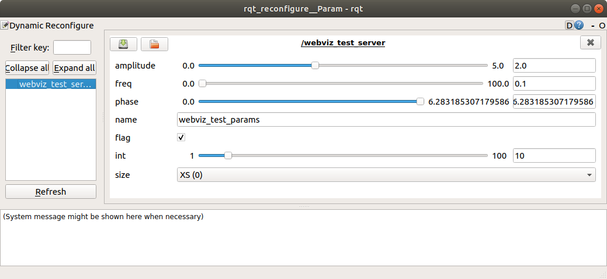
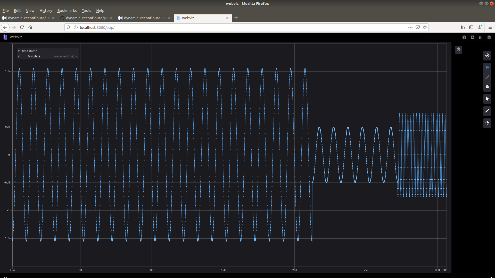

ROS Dynamic Parameter Configuration Tutorial
===================

# 1. Objective

본 Tutorial을 통해 dynamic_reconfigure package를 이용한 dynamic parameter configuration 방법을 확인한다.

# 2. Prerequisite

본 Repository의 [ROS_INSTALL.md](../ROS_INSTALL.md) 및 [WEBVIZ_INSTALL.md](../WEBVIZ_INSTALL.md)를 통한 ROS 및 Javascript support, Webviz 환경이 준비되었다고 가정한다.

## 2.1. dynamic_reconfigure package 설치

아래 명령을 통해 package 가 설치되어 있는지 확인 할 수 있다.

```sh
rospack find dynamic_reconfigure
```

만일 패키지가 설치되어 있지 않다면, 아래와 같은 명령을 이용하여 설치한다.

```sh
# catkin workspace/src 로 이동
cd PATH_TO_CATKIN_WORKSPACE/src
# Melodic branch 설치
git clone -b melodic-devel https://github.com/ros/dynamic_reconfigure/ 
# catkin workspace 로 이동
cd PATH_TO_CATKIN_WORKSPACE
catkin_make install # 또는 catkin build
```

다시 rospack 명령을 이용하여 설치가 잘 되었는지 확인 가능하다.

## 2.2. Webviz_Test_Node 설치

webviz_test package 역시 PATH_TO_CATKIN_WORKSPACE/src 내부 설치 후 build한다.

```sh
# webviz_test package를 catkin workspace/src 로 이동
mv webviz_test PATH_TO_CATKIN_WORKSPACE/src
# Catkin workspace 로 이동
cd PATH_TO_CATKIN_WORKSPACE
catkin_make install # 또는 catkin build
```

# 3. Webviz_Test_Node 소개

webviz_test_node package는 sine function의 값을 지속적으로 publish 하는 node이다. 이 때, Amplitude, Frequency, Phase 등의 parameter를 조절하여 다양한 모습의 sine function을 출력할 수 있다.

webviz_test_node package는 아래와 같이 구성되어 있다.

* cfg/WebvizTestParams.cfg
* src/webviz_test_server.py
* src/webviz_test_client.py

각 파일의 역할에 대해 아래에 설명한다.

## 3.1. cfg/WebvizTestParams.cfg

[WebvizTestParams.cfg](cfg/WebvizTestParams.cfg) 파일은 cfg 확장자를 가지고 있으나, 내용은 python으로 작성되어 있다.
이 파일은 dynamically configurable한 parameter 들을 정의해 준다. 따라서 각 node에서 사용할 dynamic parameter 들은 cfg 파일에 반드시 추가되어야 한다.
아래는 소스 코드의 일부이다.

```python
#!/usr/bin/env python3

PACKAGE = "webviz_test"

from dynamic_reconfigure.parameter_generator_catkin import *
from math import pi as M_PI

# ParameterGenerator class
gen = ParameterGenerator()

# add method를 통해 원하는 parameter를 추가해 준다.
# gen.add("PARAM_NAME", "PARAM_TYPE", "LEVEL", "Description", "VAL_INIT", "VAL_MIN", "VAL_MAX")
gen.add("amplitude", double_t, 0, "Amplitude of the sine function", 1.0, 0.0, 5.0)
gen.add("freq", double_t, 0, "Ordinary frequency of the sine function", 1.0, 0.0, 100.0)
gen.add("phase", double_t, 0, "(Phase / 2*PI) of the sine function", 0.0, 0, 2*M_PI)

# Some dummy parameters
gen.add("name", str_t, 0, "Name parameter", "webviz_test_params")
gen.add("flag", bool_t, 0, "Bool parameter", True)
gen.add("int", int_t, 0, "Integer parameter", 0, 1, 100)

size_enum = gen.enum([
    gen.const("XS", int_t, 0, "Extra Small"),
    gen.const("S", int_t, 0, "Small"),
    gen.const("M", int_t, 0, "Medium"),
    gen.const("L", int_t, 0, "Large"),
    gen.const("XL", int_t, 0, "Extra Large")
], "Enum set of size")

gen.add("size", int_t, 0, "Size parameter with enum", 0, 0, 4, edit_method=size_enum)

# package build 시 실행되어 config에 따른 c++, python interface를 만들어 준다. 이 때, 마지막 parameter의 경우 반드시 파일 명과 일치시켜야 한다. (WebvizTestParams.cfg -> WebvizTestParams)
exit(gen.generate(PACKAGE, "webviz_test_params", "WebvizTestParams"))
```

cfg 파일 작성 후, [CMakeLists.txt](CMakeLists.txt) 파일에 아래와 같은 옵션을 추가해 준다.

```
find_package(catkin REQUIRED dynamic_reconfigure)
generate_dynamic_reconfigure_options(
  cfg/Tutorials.cfg
)
```

이후 아래 명령어를 이용해 실행 권한을 부여하고 build한다.
```sh
chmod +x cfg/WebvizTestParams.cfg
cd PATH_TO_CATKIN_WORKSPACE
catkin_make install # 또는 catkin build
```

좀 더 자세한 설명은 [HowToWriteYourFirstCfgFile](http://wiki.ros.org/dynamic_reconfigure/Tutorials/HowToWriteYourFirstCfgFile) tutorial에 제공되어 있다.

## 3.2. src/webviz_test_server.py

[webviz_test_server.py](src/webviz_test_server.py) 파일은 dynamic reconfiguration 요청이 들어올 경우 요청을 처리하고 변경된 parameter를 제공해 주는 server를 실행한다.
아래는 소스 코드의 일부이다.

```python
#!/usr/bin/env python3

import rospy

from dynamic_reconfigure.server import Server
from webviz_test.cfg import WebvizTestParamsConfig


def callback(config, level):
    # Reconfiguration 요청이 들어올 경우 처리 후 log message로 변경 후 parameter 출력
    rospy.loginfo("Reconfigure request : {amplitude}, {freq}, {phase}, {name}, {flag}, {int}, {size}".format(**config))

    return config


if __name__ == "__main__":
    rospy.init_node("webviz_test_server", anonymous=False)

    # Reconfiguration을 담당할 server 실행. parameter 변경은 server 내부에서 진행 되고, callback function은 부가적으로 변경 이후 실행되는 함수이다.
    srv = Server(WebvizTestParamsConfig, callback)
    rospy.spin()
```

server node 역시 실행 권한을 부여하고, test를 위해 rqt_gui를 이용한다.

```sh
# 실행 권한 부여 및 실행
chmod +x src/webviz_test_server.py
rosrun webviz_test webviz_test_server.py
# GUI를 이용한 parameter 설정 test
rosrun rqt_gui rqt_gui -s reconfigure
```



위와 같은 GUI가 실행되며, 다양한 parameter를 쉽게 조절 할 수 있다. WebvizTestParams.cfg에 등록 된 parameter가 나타남을 확인 할 수 있다.

좀 더 자세한 설명은 [Setting up Dynamic Reconfigure for a Node (python)](http://wiki.ros.org/dynamic_reconfigure/Tutorials/SettingUpDynamicReconfigureForANode%28python%29) tutorial에 제공되어 있다.

## 3.3. src/webviz_test_client.py

[webviz_test_client.py](src/webviz_test_client.py) 파일은 parameter server 에 저장된 parameter를 읽어와 사용하는 node이다. 아래는 소스코드의 일부이다.

```python
#!/usr/bin/env python3

import rospy
import std_msgs
from math import pi as M_PI
from math import sin

from dynamic_reconfigure.client import Client
from webviz_test.cfg import WebvizTestParamsConfig

# Config가 변경 될 때 실행되는 callback 함수
def callback(config):
    rospy.loginfo("Configuration callback")
    return

if __name__ == "__main__":
    rospy.init_node("webviz_test_client")

    # Parameter Server에 접속하여 dynamic parameter를 사용 가능하게 하는 client
    client = Client("webviz_test_server", timeout=30, config_callback=callback)

    # Sine function 값을 계산하여 출력하는 publisher
    pub = rospy.Publisher("sin", std_msgs.msg.Float64, queue_size=1)

    # 10 Hz로 동작
    r = rospy.Rate(10)
    t0 = rospy.Time.now()
    while not rospy.is_shutdown():
        # client를 통해 server로 부터 config를 읽어온다.
        # cfg 파일에 정의된 parameter를 가지고 있다.
        # get_configuration 함수가 callback을 호출하지 않음.
        config = client.get_configuration()

        # config에서 필요한 parameter를 읽어온다.
        A = config.amplitude
        w = config.freq
        p = config.phase
        name = config.name
        v_flag = config.flag
        v_int = config.int
        v_size = config.size

        # Sine function 계산 후 publish
        t1 = rospy.Time.now()
        t = (t1 - t0).to_sec()

        val = std_msgs.msg.Float64()
        val.data = A*sin(2*M_PI*w*t + p)

        pub.publish(val)

        r.sleep()
```

client node 역시 실행 권한을 부여하고, test를 위해 webviz를 이용한다.

```sh
# 실행 권한 부여 및 실행
chmod +x src/webviz_test_client.py
rosrun webviz_test webviz_test_client.py
```

Webviz에 접속하여 /sin topic을 plot하여 sine function이 그려지는 것을 확인 할 수 있다.
GUI를 사용하지 않고 parameter를 변경하기 위해 아래와 같은 명령어를 사용한다.

```sh
# Dynamically reconfigurable node list check
# Node의 이름만 확인 가능
rosrun dynamic_reconfigure dynparam list
# webviz_test_server node parameter list check
# 해당 노드에 어떤 parameter를 설정 할 수 있는지 확인 가능
rosrun dynamic_reconfigure dynparam get webviz_test_server
# Amplitude를 0.5로 설정
rosrun dynamic_reconfigure dynparam set webviz_test_server amplitude 0.5
# Freq = 0.5, Amplitude = 0.75로 설정
rosrun dynamic_reconfigure dynparam set webviz_test_server "{'amplitude':0.75, 'freq':0.5}"
```

위 커맨드를 통해 아래와 같은 webviz plot을 얻을 수 있다.



좀 더 자세한 설명은 [Using the Dynamic Reconfigure Python Client](http://wiki.ros.org/dynamic_reconfigure/Tutorials/UsingTheDynamicReconfigurePythonClient) tutorial에 제공되어 있다.

# 4. Note

위와 같이 parameter configuration을 구현 할 경우 parameter 정의를 추가해야 하는 번거로움이 있다.

그러나 Webviz 측에서 service call 등의 ros API 사용 없이 system function call을 통해 parameter 변경이 가능할 것으로 예상되어 Webviz-ROS interface가 훨씬 간편해 지는 장점이 있다.
